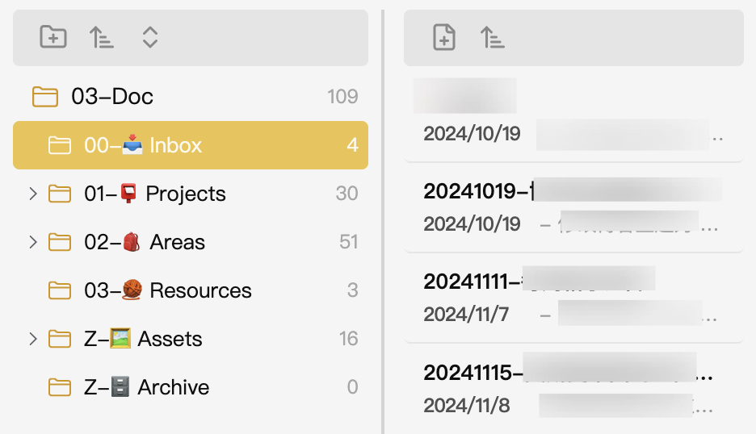

当然可以，下面是你的 `README` 文件的中文翻译：
# Apple Style Notes 插件

[英文](./README.md) | [中文](./README.zh.md)

**Apple Style Notes** 是一款 Obsidian 插件。它通过将文件夹和文件列表分开展示，从而提供了一种全新的文件管理方式。插件的界面交互受苹果设计理念的启发，旨在提供一种更简洁、更直观的方式来浏览和整理笔记。

## 功能
- **分屏视图**：将文件夹和文件分开展示，帮助你更好地了解笔记的结构。
- **改进的导航**：轻松在文件夹和文件间导航，提升工作效率。
- **增强的文件管理**：通过简化界面，集中管理最重要的内容，提升可用性。

## 安装
### 方法 1：手动安装
- 下载插件并将其放置在 Obsidian 的插件文件夹中。
- 在 Obsidian 设置中的“社区插件”标签下启用插件。

## 卸载
要卸载插件，只需在 Obsidian 插件设置中禁用或删除插件。如果你需要重置所有设置，可以在设置菜单中清除插件设置。

## What's Next
- **自定义设置**：允许用户自定义插件行为，例如设置添加新文件或文件夹时的默认位置、定制文件/文件夹排序等。
- **移动端支持**：为 Obsidian 的移动端适配插件，确保跨设备的无缝文件管理。
- **拖拽功能**：启用文件和文件夹的拖拽功能，简化重组操作。
- **标签管理**：引入标签管理功能，让文件组织系统更加灵活。

## 更新日志
- **v0.0.1**：初始版本，包含文件夹/文件分屏视图和改进的导航功能。

## 反馈与问题
如果你遇到任何 bug 或有功能建议，欢迎你在这个 [GitHub 仓库](https://github.com/XuQuan-nikkkki/apple-style-notes-plugin)中提交问题。你的反馈对于改进 Apple Style Notes 插件非常重要！
