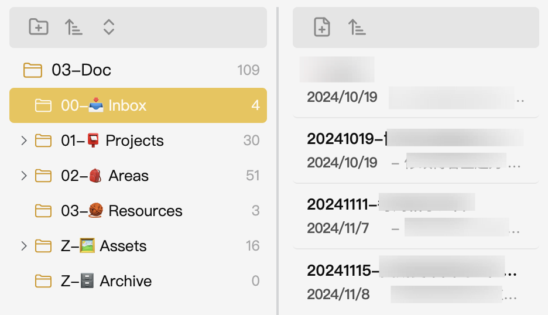

# Apple Style Notes Plugin

**Apple Style Notes** is an Obsidian plugin that brings a fresh approach to file management by splitting folders and files into distinct, visually separated lists. Inspired by Apple's elegant design principles, this plugin offers a cleaner, more intuitive way to browse and organize your notes.

## Features
- **Split View**: Separates folders and files into different panels for a better overview of your note structure.
- **Improved Navigation**: Navigate through folders and files effortlessly without losing track of your location.
- **Enhanced File Management**: Focus on what matters most with a streamlined interface that prioritizes usability.

## Install
- Download the plugin and place it in your Obsidian plugins folder.
- Enable the plugin in the Obsidian settings under the "Community Plugins" tab.

## What's Next
- **Mobile Support**: Adapt the plugin for use on Obsidian's mobile app, ensuring seamless file management across devices.
- **Drag-and-Drop**: Enable drag-and-drop functionality for files and folders to simplify reorganization.
- **Tag-Based Management**: Introduce the ability to manage files using tags for a more flexible organization system. 

## Contributions
Feel free to contribute to the development of this plugin by submitting pull requests or suggesting improvements. Your feedback helps make Apple Style Notes even better!

